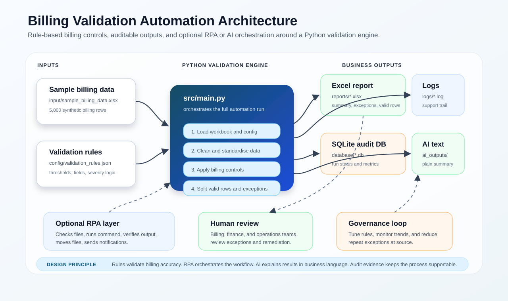

# Billing Validation Automation

A Python automation project that validates a monthly billing workbook, detects billing and data-quality exceptions, creates an Excel exception report, writes audit records to SQLite, and prepares a plain-language AI summary file for stakeholder review.

This project is designed as a realistic operations automation example. It shows how billing, finance, service delivery, and operations teams can use rule-based automation to improve accuracy, traceability, and exception handling before invoices are released.

## What The Automation Does

The automation reads `input/sample_billing_data.xlsx` and checks each billing line against configurable rules in `config/validation_rules.json`.

It produces:

- an Excel exception report in `reports/`
- a run log in `logs/billing_automation.log`
- an audit database in `database/automation_audit.db`
- an AI-ready summary text file in `ai_outputs/`

## Main Features

- Validates required billing columns before processing starts.
- Cleans dates, text fields, and numeric billing amounts.
- Detects missing mandatory fields.
- Detects missing or invalid expected and billed amounts.
- Detects billing mismatches against a tolerance.
- Escalates large billing differences as high-severity exceptions.
- Detects duplicate customer invoice records.
- Flags inactive services being billed.
- Flags expired contracts still being charged.
- Flags invoice dates outside the billing period.
- Flags non-ZAR records in a local billing run.
- Flags large month-on-month usage anomalies.
- Creates stakeholder-friendly Excel reports.
- Records every run in SQLite for auditability.
- Creates a text summary that can be passed into an AI or RPA tool.

## Architecture



For a more detailed breakdown of the processing layers, outputs, RPA touchpoints, and governance loop, see [docs/ARCHITECTURE.md](docs/ARCHITECTURE.md).

## Folder Structure

```text
billing-validation-automation/
|-- ai_outputs/               AI-ready plain-language summary files
|-- config/                   Editable validation rules and thresholds
|-- database/                 SQLite audit database
|-- docs/                     Project documentation
|-- input/                    Sample source billing workbook
|-- logs/                     Run logs
|-- reports/                  Generated Excel exception reports
|-- src/                      Automation source code
|-- tests/                    Unit tests and no-install test runner
|-- requirements.txt          Python dependencies
|-- run_automation.cmd        Windows command runner
|-- run_automation.ps1        PowerShell runner
|-- run_tests.cmd             Windows test runner
|-- .gitignore
|-- LICENSE
`-- README.md
```

## Quick Start

Create and activate a virtual environment:

```powershell
python -m venv .venv
.\.venv\Scripts\Activate.ps1
```

Install dependencies:

```powershell
pip install -r requirements.txt
```

Run the automation:

```powershell
python src/main.py
```

Or use the provided Windows runner:

```powershell
.\run_automation.ps1
```

Run tests:

```powershell
python tests/run_tests.py
```

If `pytest` is installed:

```powershell
python -m pytest tests -q
```

## Sample Run Results

The included sample data contains 5,000 synthetic billing records with intentionally planted exceptions.

The verified automation run produced:

```text
Source records processed: 5000
Valid records: 4338
Rows with exceptions: 662
Total exception records: 752
Critical exceptions: 80
High exceptions: 408
Medium exceptions: 264
```

The generated Excel report includes:

- `Run Summary`
- `Severity Summary`
- `Exception Type Summary`
- `Exceptions`
- `Valid Records`

## Validation Rules

The rules are stored in `config/validation_rules.json` so business thresholds can be changed without editing Python code.

Examples:

- `billing_tolerance`: acceptable difference between expected and billed amount.
- `high_difference_threshold`: amount at which a billing mismatch becomes high severity.
- `usage_anomaly_multiplier`: month-on-month increase that should be reviewed.
- `mandatory_fields`: fields required for billing traceability.
- `required_columns`: columns that must exist before processing starts.

This is important because billing rules often change. Keeping them in configuration makes the automation easier to support, test, and govern.

## Code Overview

- `src/main.py` orchestrates the run from start to finish.
- `src/paths.py` keeps project paths in one place.
- `src/config_loader.py` reads validation settings from JSON.
- `src/data_loader.py` loads the billing workbook.
- `src/rule_engine.py` applies all validation controls.
- `src/reporter.py` creates the Excel output report.
- `src/audit.py` records run status in SQLite.
- `src/notifier.py` builds a business-friendly notification message.
- `src/ai_summary.py` creates plain-language context for AI tools.

## RPA Integration Idea

An RPA workflow such as UiPath can orchestrate this project without rebuilding the validation logic.

Typical RPA steps:

1. Check that the input workbook exists.
2. Run `run_automation.cmd` or `python src/main.py`.
3. Wait for the Python process to finish.
4. Check that a new Excel report was created.
5. Read the latest AI summary text file.
6. Send the report or summary to the relevant team.
7. Log success or failure for support.

This keeps Python responsible for data validation and keeps RPA responsible for scheduling, file movement, application interaction, and notifications.

## AI Extension Idea

The automation does not use AI to make billing decisions. Billing decisions are rule-based and auditable.

AI can be safely added after validation to:

- summarise exception reports
- explain trends in plain language
- draft stakeholder update messages
- classify recurring exception themes
- help support teams understand failed runs

The principle is:

```text
Rules validate. RPA orchestrates. AI explains.
```

## Notes On Data

The workbook in `input/sample_billing_data.xlsx` contains synthetic data only. It is not real customer data.

The planted issues are included to demonstrate how the automation behaves when it finds real-world billing problems such as duplicates, inactive services, expired contracts, missing amounts, and billing mismatches.

## License

This project is released under the MIT License.
