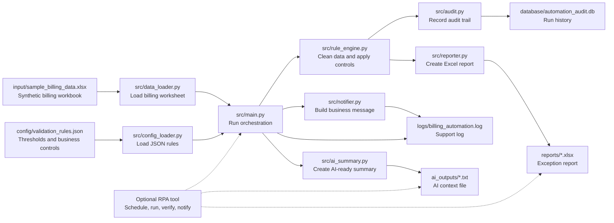

# Architecture

This project is organised around a simple operational idea:

```text
Rules validate. RPA orchestrates. AI explains. Audit evidence supports the process.
```

## Visual Overview


## Mermaid Version



## Layers

### 1. Input Layer

The automation starts with two inputs:

- `input/sample_billing_data.xlsx`
- `config/validation_rules.json`

The workbook contains the billing records. The JSON file contains the rules, thresholds, required columns, mandatory fields, and severity logic.

### 2. Processing Layer

The Python source files are deliberately split by responsibility:

- `main.py` controls the sequence of the automation.
- `data_loader.py` loads the Excel worksheet.
- `config_loader.py` loads validation settings.
- `rule_engine.py` applies billing, data-quality, and operational controls.
- `reporter.py` creates the Excel report.
- `audit.py` records the run status and metrics.
- `notifier.py` creates a plain business notification.
- `ai_summary.py` creates an AI-ready text summary.

### 3. Output Layer

Each run creates operational evidence:

- `reports/` contains the Excel exception report.
- `logs/` contains the run log for support and troubleshooting.
- `database/` contains SQLite audit records.
- `ai_outputs/` contains plain-language context for an AI or RPA activity.

### 4. Optional RPA Layer

An RPA tool can sit around the Python automation:

1. Check that the input file exists.
2. Run the Python automation.
3. Confirm the report was created.
4. Read the AI summary text.
5. Send a notification or hand off exceptions for review.

This keeps the validation rules testable in Python while letting RPA handle scheduling, file checks, notifications, and system interaction.

### 5. Governance Loop

The output report and audit database are not only end products. They help the team improve the process:

- track repeated exceptions
- identify source-system data issues
- tune validation thresholds
- reduce future billing disputes
- monitor automation success and failure trends
